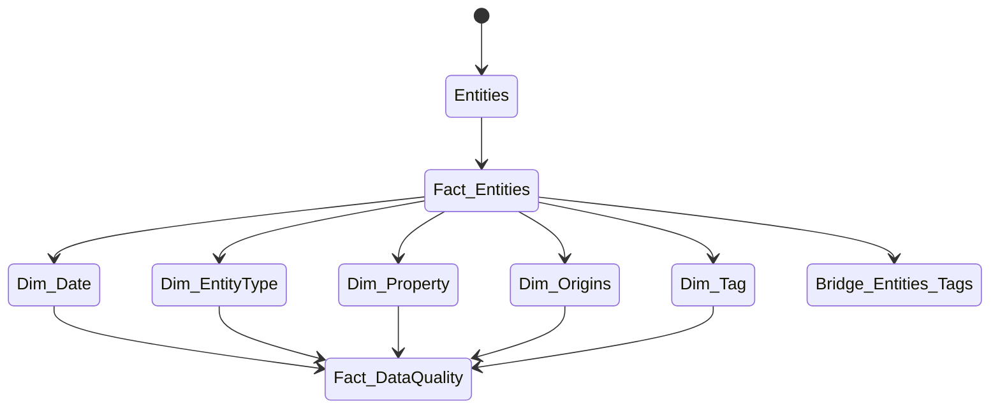
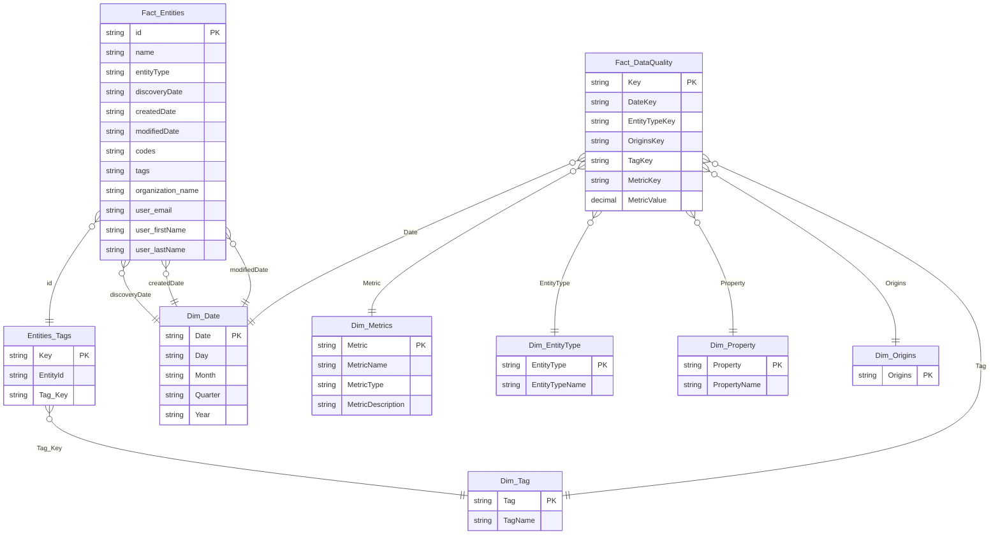

Naming conventions:

- Fact tables are prefixed with `Fact_`
- Dimension tables are prefixed with `Dim_`
- Bridge tables are prefixed with `Bridge_`
- Fact tables are in plural form
- Dimension tables are in singular form
- Bridge tables are in plural form
- Columns are in CamelCase
- Primary keys are named `Key`
- Foreign keys are prefixed with the referenced table name
- Foreign keys are in singular form
- Foreign keys are suffixed with `Key`

Fixtures:

- `fixtures/cluedin-0.parquet` empty CluedIn instance
- `fixtures/cluedin-1.parquet` Salesforce Organizations and Contacts
- `fixtures/cluedin-2.parquet` CRM Organizations and Contacts
- `fixtures/cluedin-3.parquet` mapped `/Person` name, last name, and email to core vocabularies
- `fixtures/cluedin-4.parquet` tag invalid emails
- `fixtures/cluedin-5.parquet` merge contacts
- `fixtures/cluedin-6.parquet` fix invalid emails

